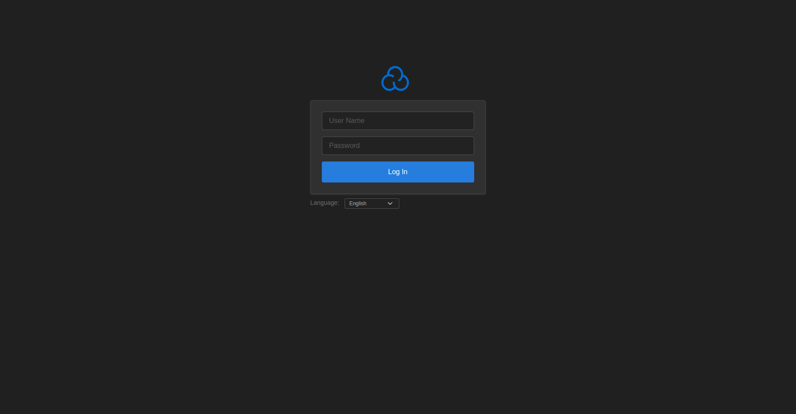
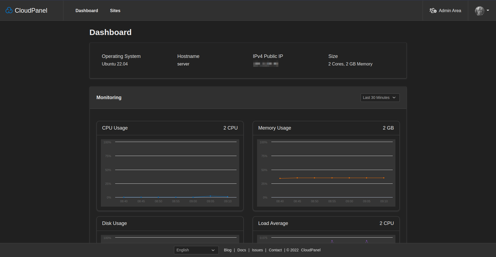
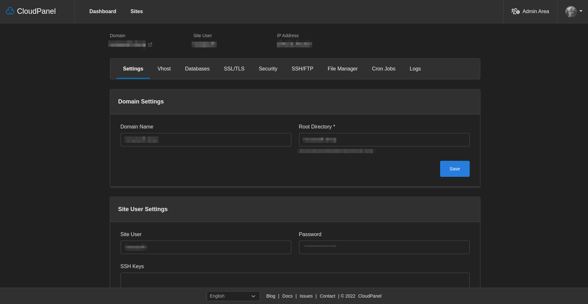
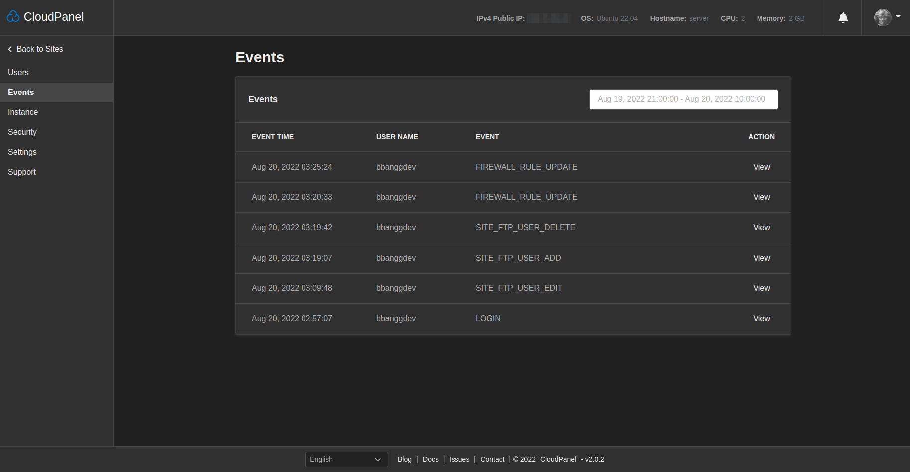

## cloudpanel-dark

> ⭐ Please don't forget to star my project

## Install

```bash
cd ~
git clone https://github.com/bbangg/cloudpanel-dark.git
cd cloudpanel-dark
./install.sh
```

## Uninstall (just reverts changes)

```bash
./uninstall.sh
```

## Feature list

- [x] update cloudpanel logo for dark theme
- [x] update current css files for dark theme
- [ ] change ace editor theme
- [ ] change file manager theme

## Screenshots





